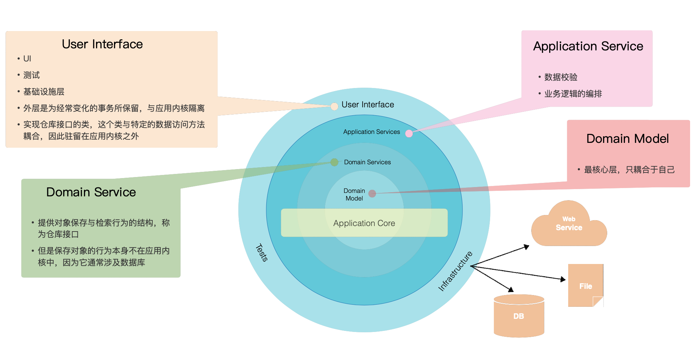

# Getting Started

### 代码风格中涉及的概念

代码采用“洋葱圈架构”的形式进行组织，如下图所示

代码分为四个层次：从内到外依次是：领域层（Domain Model）、领域服务层（Domain Service）、应用服务层（Application Service）、基础设施和接口层（User Interface & Infrastructure)。每一层的职责见图中描述部分。 代码需要满足**单向依赖**的关系：即外层依赖内层或同层，而不能反向依赖。主要目的是为了保证**内聚性：核心业务逻辑应该聚合与Domain Model和Domain Service**。代码架构可以参考：

- [洋葱圈架构/Onion Architecture](https://www.codeguru.com/csharp/csharp/cs_misc/designtechniques/understanding-onion-architecture.html)

- [DDD](https://en.wikipedia.org/wiki/Domain-driven_design)

